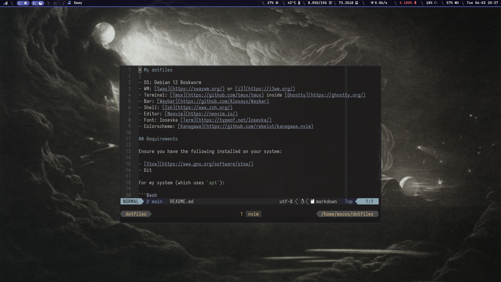

# My dotfiles

## Installation

To install and set any of the dotfiles in this repo on a new machine, first clone the repo inside `$HOME`:

```Bash
git clone https://github.com/MoXcz/dotfiles
cd dotfiles
./setup.sh
```

And then select the one you wish to use (which is just a simple symlink with `stow`).

## paradise-lost



- OS: Debian 12 Bookworm
- WM: [Sway](https://swaywm.org/) or [i3](https://i3wm.org/)
- Terminal: [Tmux](https://github.com/tmux/tmux) inside [Ghostty](https://ghostty.org/)
- Bar: [Waybar](https://github.com/Alexays/Waybar)
- Shell: [Zsh](https://www.zsh.org/)
- Editor: [Neovim](https://neovim.io/)
- Font: [Iosevka Term](https://typeof.net/Iosevka/)
- Colorscheme: [Kanagawa](https://github.com/rebelot/kanagawa.nvim)

### Requirements

Ensure you have the following installed on your system:

- [Stow](https://www.gnu.org/software/stow/)
- Git

This configuration requires a Debian-based environment to work (otherwise you will have to tune it yourself):

```Bash
sudo apt install git
sudo apt install stow
```

### Script

Select `Run All` on the menu that appears (if `bemenu` is not installed run `run_bak.sh`; should be installed if running the installation script for sway first):

Then, use GNU stow to create symlinks

```Bash
stow .
```

### Greatly Inspired by

1. https://github.com/josean-dev/dev-environment-files
2. https://github.com/ThePrimeagen/init.lua
3. https://github.com/tjdevries/config.nvim

## Omarchy


- OS: [Archlinux](https://archlinux.org/) btw
- WM: [Hyprland](https://github.com/hyprwm/Hyprland)
- Terminal: [Tmux](https://github.com/tmux/tmux) inside [Ghostty](https://ghostty.org/)
- Bar: [Waybar](https://github.com/Alexays/Waybar)
- Shell: [Zsh](https://www.zsh.org/)
- Editor: [Neovim](https://neovim.io/)
- Font: [Iosevka Term](https://typeof.net/Iosevka/)
- Colorscheme: [Kanagawa](https://github.com/rebelot/kanagawa.nvim)

### Requirements

- [Stow](https://www.gnu.org/software/stow/)
- Git
- Omarchy

### Installation

1. Install Arch
2. Install Omarchy
3. Clone repo

### From:

1. [Omarchy](https://omarchy.org/)

